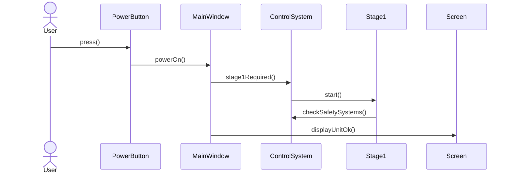
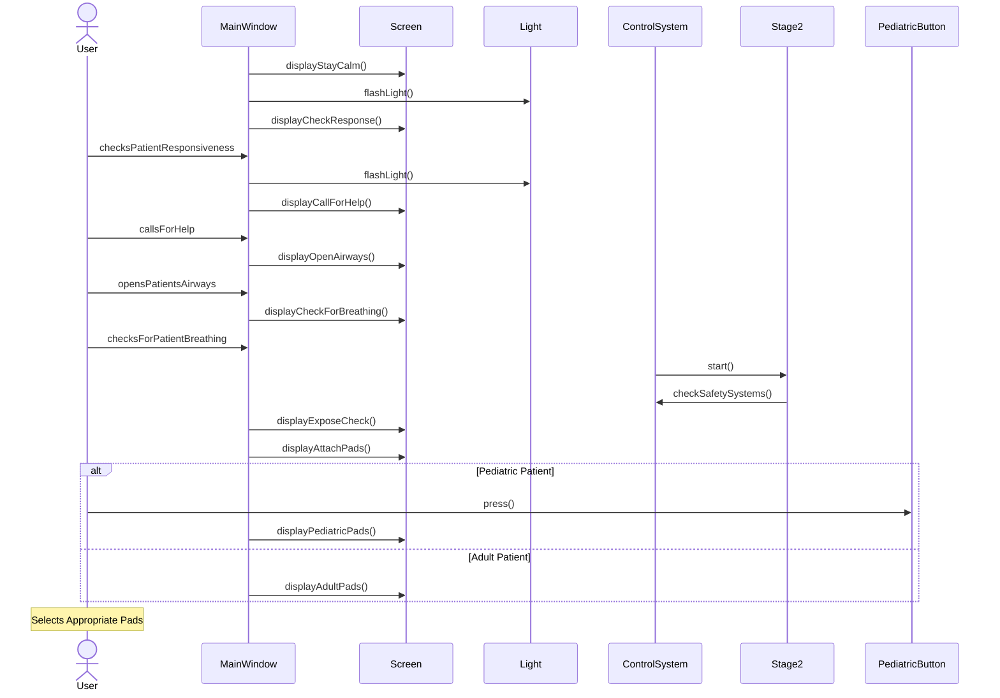
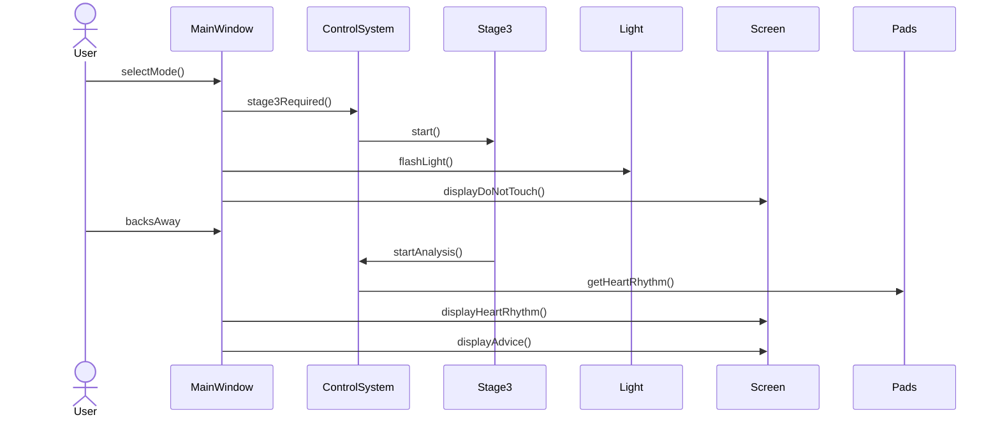
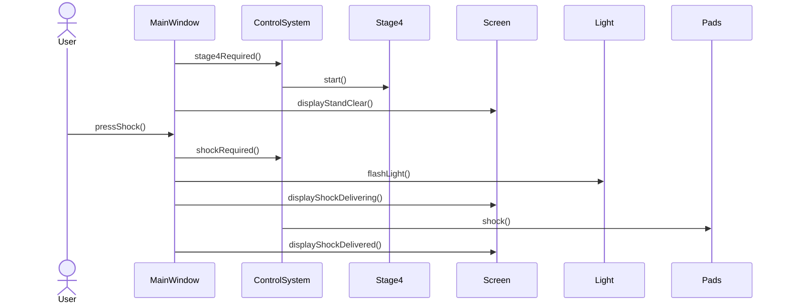
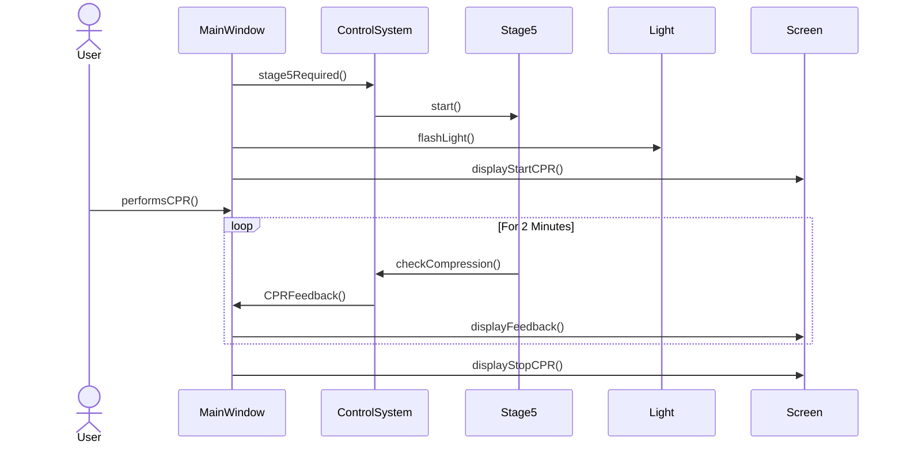
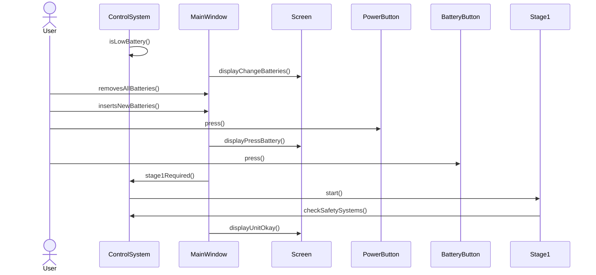
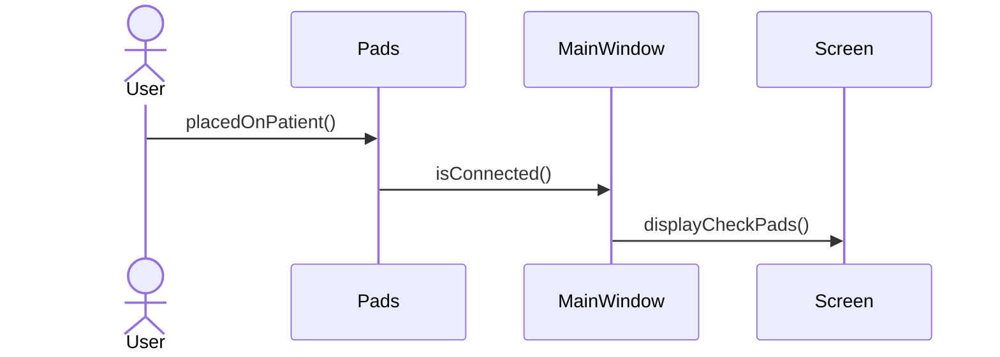
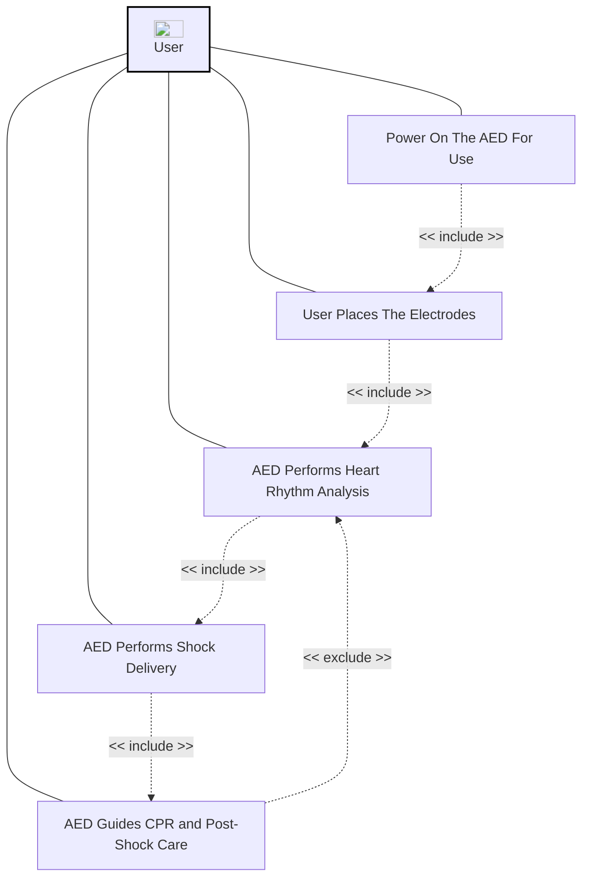
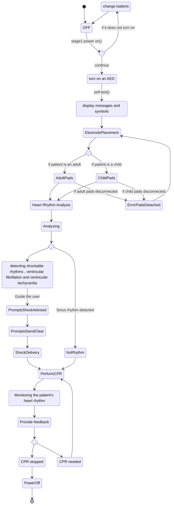

# AED-System

Project Description

## Run Instructions

```bash
cd src/
make all
```


## Requirements

**Linux**: 

QtSvg library

```bash
sudo apt install libqt5svg5-dev
```

---

**macOS**: 

Qt5 framework

```bash
brew install qt@5
```

## Sequence Diagrams

### UC1: Power On AED
This shows the case of the user truning on the AED. The user presses the power button, then the system checks to make sure the safety conditions are met and displays the "UNIT OKAY".


### UC2: Electrodes Placement
This shows the case of the user placing the electrode pads on the patient. The device instructs the user, telling them what actions they should perform in order to safely place the electrodes. The system checks to make sure the pads are connected, and adjusts defibrillation energy settings depending on the pads the use selected.


### UC3: Heart Rythm Analysis
This shows the case of the AED performing a heart rhythm analysis. The system detects and displays the patients rhythm, then provides the user with advice on how to proceed.


### UC4: Shock Delivery
This shows the case of the AED delivering a shock to the patient. The system detected a shockable rhythm, then delivers a shock(s) to the patient in an attempt to restore a normal heartbeat.


### UC5: CPR
This shows the case of the AED guiding the user through CPR. The system displays the instructions to the screen, then monitors and provides real-time CPR feedback to the user for 2 minutes.


### UC6: Low Battery
This shows the safety scenario for when the AED battery is low. The system detects that its battery is low. It prompts the user to change the batteries and persoms a safety check afterwards to ensure proper functionality and sufficient battery power.


### UC7: Pads Error
This shows the safety scenario for when the electrode pads are not connected/attached correctly. The system detects that the pads are not properly connected/attached then prompts the user to "CHECK ELECTRODE PADS".


## UML Class Diagrams

```mermaid
classDiagram

    QObject <|-- AEDController
    QObject <|-- Pads
    QObject <|-- QAEDScreen
    QObject <|-- StageManager
    QObject <|-- QLabel
    QObject <|-- QIconButton
    QObject <|-- StageManager

    QSvgWidget <|-- QAEDScreen
    QFont <|-- QCustomIconsFont
    QPushButton <|-- QIconButton
    QTabWidget <|-- QScreenSettings
    QWidget <|-- QSvgWidget

    AEDController "1" -- "1" QAEDScreen : screen
    AEDController "1" -- "1" Pads : pads
    AEDController "1" -- "0..*" StageManager : stages

    StageManager "1" -- "1" AEDController : controller
    StageManager "1" -- "1" QAEDScreen : screen
    StageManager "1" -- "1" Pads : pads

    StageManager <|-- Stage1
    StageManager <|-- Stage2
    StageManager <|-- Stage3
    StageManager <|-- Stage4
    StageManager <|-- Stage5
    StageManager <|-- Stage6

    AEDController "1" -- "1" QAEDScreen : screen
    AEDController "1" -- "1" Pads : pads
    AEDController "1" -- "0..*" StageManager : stages

    QMainWindow "1" -- "1" AEDController : controller
    QMainWindow "1" -- "1" QScreenSettings : screenSettings

    class QObject {
    }

    class QMainWindow {
    }

    class AEDController {
        -Stage mainStage
        -QAEDScreen* screen
        -QThread* screenThread
        -Pads* pads
        -QMap<Stage, StageManager*> stages
        -QMap<Stage, QThread*> stageThreads
        -QIconButton* powerButton
        -QIconButton* pediatricButton
        -QLabel* powerIndicator
        -QLabel* pediatricIndicator
        -bool systemFault
        -int powerCapacity
        -int numShocks
        +AEDController(QObject* parent)
        +~AEDController()
        +void changeMainstage(Stage s)
        +void addShock()
        +bool isSystemFault()
        +bool isLowBattery()
    }

    class Pads {
        -bool attached
        -bool connected
        -bool adult
        -int depth
        -int bpm
        -Rhythms rhythm
        -bool clear
        +Pads(QObject *parent)
        +void attach()
        +void detach()
        +void shock()
        +bool isAttached()
        +bool isConnected()
        +bool isClear()
        +~signal~ void depthChanged(int newDepth)
    }

    class QAEDScreen {
        -Stage stage
        -QDomElement* timeText
        -QDomElement* shocksText
        -QDomElement* countdownText
        -QDomElement* bpmText
        -QTimer* timer
        -QTime startTime
        -QTime countdownTime
        -bool countdownActive
        +QAEDScreen(QWidget *parent)
        +~QAEDScreen()
        +void startCountdown()
        +void stopCountdown()
        +void clearAll()
        +void updateTime()
        +bool showMsg1UnitOk(bool show)
        +... // Additional methods
    }

    class QCustomIconsFont {
        +~static~ QCustomIconsFont& instance()
        -QCustomIconsFont()
        -QCustomIconsFont(const QCustomIconsFont&)
        -QCustomIconsFont& operator=(const QCustomIconsFont&)
    }

    class QIconButton {
        -int size
        +QIconButton(const QString &text, QWidget *parent)
        +void on()
        +void off()
        -void stylize()
    }

    class QScreenSettings {
        -AEDController* controller
        +QScreenSettings(AEDController* controller, QWidget *parent)
        +~QScreenSettings()
        -void stage1Init()
        -void stage2Init()
        -void stage3Init()
        -void stage4Init()
        -void stage5Init()
        -void stage6Init()
        -void adminPanel()
    }

    class QSvgWidget {
        -QSvgRenderer* svgRenderer
        -QDomDocument svgDom
        -QMap<QString, QDomElement*> elements
        -QMutex* mutex
        +QSvgWidget(const QString &fileName, QWidget *parent)
        +~QSvgWidget()
        +void refresh()
        -void showElement(QDomElement* element, bool show)
        -void showElementId(const QString &id, bool show)
        -void changeText(QDomElement* element, const QString &s)
        -void resizeMask(QDomElement* element, float width, float height)
        -void shiftElement(QDomElement* element, int x, int y)
        +paintEvent(QPaintEvent *event)
    }

    class StageManager {
        -AEDController* controller
        -QAEDScreen* screen
        -Pads* pads
        -Stage stage
        -int status
        -QTimer* timer
        +StageManager(Stage s, AEDController* controller, QObject *parent)
        +bool start() ~Abstract~
        +void stop() ~Abstract~
        +bool nextStage() ~Abstract~
        +bool isDone() const
        +bool isActive() const
        +bool isIdle() const
        +bool isError() const
        +void step() ~Abstract~
    }

    class Stage1 {
        -Stage1Power status
        -const int interval
        -int intervalCount
        -int instruction
        -bool power
        +Stage1(AEDController* controller, QObject *parent)
        +bool start()
        +void stop()
        +bool nextStage()
        +void step()
        +bool checkSafetySystems()
    }

    class Stage2 {
        -const int interval
        -int intervalCount
        -bool init
        -bool adultLocal
        -bool showPediatricOption
        -int pediatricOptionTime
        +Stage2(AEDController* controller, QObject *parent)
        +bool start()
        +void stop()
        +bool nextStage()
        +void step()
        +bool checkSafetySystems()
    }

    class Stage3 {
        -int ecgPercent
        -int rIndex
        -int stepCount
        +Stage3(AEDController* controller, QObject *parent)
        +bool start()
        +void stop()
        +bool nextStage()
        +void step()
    }

    class Stage4 {
        -const int interval
        -int intervalCount
        -bool shocked
        +Stage4(AEDController* controller, QObject *parent)
        +bool start()
        +void stop()
        +bool nextStage()
        +void step()
        +bool checkShockableRhythm()
    }

    class Stage5 {
        -const int interval
        -int intervalCount
        -int maxTicks
        -int depth
        -int lastDepth
        -int idleCount
        -int timeCount
        -bool cprIndicator
        +Stage5(AEDController* controller, QObject *parent)
        +bool start()
        +void stop()
        +bool nextStage()
        +void step()
        +void checkCompression()
    }

    class Stage6 {
        +Stage6(AEDController* controller, QObject *parent)
        +bool start()
        +void stop()
        +bool nextStage()
        +void step()
    }
```


### Use Case Diagram


### State Diagram


