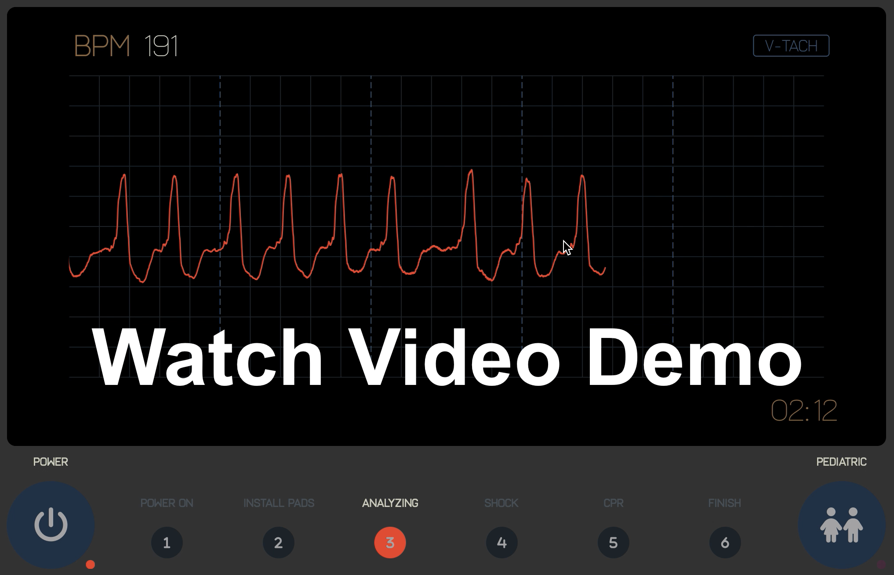

# AED-System

Project Description

## Run Instructions

```bash
cd src/
make all
```

## Requirements

**Linux**: 

QtSvg library

```bash
sudo apt install libqt5svg5-dev
```

---

**macOS**: 

Qt5 framework

```bash
brew install qt@5
```

# File directory

```bash
AED-System/
├── README.md
├── graphics/
│   ├── layers.png
│   ├── screen_artboard.png
│   ├── screen_wireframe.png
│   └── screens.ai # Source file used to create the SVG screen.svg file
├── assets/
│   └── fonts
│       ├── fa-solid-900.ttf # Icon font
│       └── frank-light.ttf
└── src/
    ├── AEDController.cpp
    ├── AEDController.h # Controller class for all the different stages
    ├── Makefile
    ├── Pads.cpp
    ├── Pads.h # Provides sensor data to controller for rhythm, heart rate and more
    ├── QAEDScreen.cpp
    ├── QAEDScreen.h # Extends the SVG class, provides method to easily use screen
    ├── QCustomIconsFont.h # Imports custom font
    ├── QIconButton.cpp
    ├── QIconButton.h # Extends QPushButton but uses font icon
    ├── QScreenSettings.cpp
    ├── QScreenSettings.h # Admin panel class, controls Pads sensor data
    ├── QSvgWidget.cpp
    ├── QSvgWidget.h # Directly manipulates svg files to show/hide their elements
    ├── Stage1.cpp
    ├── Stage1.h # Initializes AED, shows initial instructions
    ├── Stage2.cpp
    ├── Stage2.h # Pad installation and instructions
    ├── Stage3.cpp
    ├── Stage3.h # Heart rhythm analysis and ECG
    ├── Stage4.cpp
    ├── Stage4.h # Shocks patient
    ├── Stage5.cpp
    ├── Stage5.h # Administers and guides user through CPR
    ├── Stage6.cpp
    ├── Stage6.h # Turns off AED
    ├── StageManager.cpp
    ├── StageManager.h # Abstract class that's extended by Stage1-6 classes 
    ├── Team17AED.pro # Qt project config file
    ├── aed_stages.h # enums with all the different Stages and their states
    ├── defs.h # global defines/settings
    ├── main.cpp # Sets up the GUI, main window and runs the application
    └── screen.svg # SVG file containing all the graphics for the screen

```
# Video Demo & Testing

[](https://youtu.be/-twgo3yUh5U)

# Design Patterns

### **Overview**

This was created using CPP with the Qt framework. It is an AED device that simulates the functionality of an automated electronic defibrillator device.

We have independent stage manager objects which manage the functionality of each stage as well as individual objects such as a debugging menu and a GUI to reflect correct feedback throughout the stages of using an AED. On the back end all stage `Stage1 - Stage6` classes are managed by `AEDController` where each stage is on its own thread, making it a concurrent system. 

### **OOP Design Patterns**

**Observer**

It implements the Observer state design which allows a one to many dependency relationship when one object changing updates the rest of the system.

For example in our project the status of pad attachment will change variables which are recognized by multiple other objects which in turn have their own functions responding to the status of pad attachment.

This allows us to accurately simulate the effect of certain variables which influence core functionality of the AED such as pediatric/adult patient, pad attachment status, heart beat analysis result etc.

**State**

We also implement a State design pattern which modifies the functions of our objects as there state changes. For example our stage objects will perform safety checks based on the status of certain elements such as if the patient is being touched by the rescuer, which will cause the shock in stage 4 to be delayed until they are not being touched. As specific states during AED defibrillation can interfere with resuscitation this is an essential feature to allow objects to verify the correctness of all states before it can go through with the necessary functions, as well as vice versa with AED objects pausing functions or outputting error/ instruction messages if the state is not correct.

**Controller**

Our program implements the Controller design pattern as well using the AEDcontroller object which acts as a centralized control for the rest of the objects in our source code.

While the other objects oversee the individual segments of the AED use case the AEDcontroller is responsible for the creation of an interface which unifies these individual stages. It has functions which are responsible for creating the interface as well as switching between stages.

# Use cases

### **Use Case 1: Power on the AED for use**

<u>Primary actor:</u> 

- User

<u>Preconditions:</u> 

- The AED is turned off

<u>Main success scenario:</u>

1. User presses the power button
2. AED turns on
3. AED performs a self test
4. AED displays “UNIT OK” message
5. AED sends voice prompt “UNIT OK”

<u>Postconditions</u>: 

- The device is turned on and ready to use

<u>Extensions</u>:

- **2a**. AED does not turn on
- **2a1**. The user must replace all batteries at the same time. If the device does not turn on after, remove it from service
- **4a**. AED screen displays and voice prompts the user with “CHANGE BATTERIES” message
- **4a1**. The user must replace all 10 batteries and press the button in the battery well only after installation of new batteries
- **4b**. AED screen displays and voice prompts the user with “UNIT FAILED” message indicating the device has failed its power up self test and is not usable for victim care
- **4b1**. The user performs a manual test by pressing and holding the Power button for more than 5 seconds. If the unit fails the test again, remove it from service

<hr>

### **Use Case 2: User Places the Electrodes**

<u>Primary actor:</u> 

- User

<u>Preconditions</u>: 

- The AED is power on and ready for use

<u>Main success scenario:</u>

1. AED displays and voice prompts user with “STAY CALM” message
2. AED displays and voice prompts user with “CHECK RESPONSIVENESS” message while the related graphic indicator light flashes
3. User shakes the victim and asks if they are “OK?”
4. AED displays and voice prompts user with “CALL FOR HELP” message while the related graphic indicator light flashes
5. User calls someone for help
6. AED displays and voice prompts user with “OPEN AIRWAYS” message
7. User opens patients airways
8. AED displays and voice prompts user with “CHECK FOR BREATHING” message
9. User checks to see if patient is breathing
10. AED displays and voice prompts user with “EXPOSE BARE CHEST” messages
11. AED displays and voice prompts user with “ATTACH DEFIB PADS TO PATIENT’S BARE CHEST” messages while the related graphic indicator light flashes
12. User selects the appropriate set of electrode pads (Adult or Child) and connects the electrode cable with the electrode connector
13. Places the pads on the patient's bare chest as guided by the electrode pads package instructions
14. AED displays and voice prompts user with “ADULT PADS” or “PEDIATRIC PADS”, depend on which ones it detects are connected and adjusts defibrillation energy settings accordingly

<u>Postconditions</u>:

- The electrode pads are set properly and ready for use

<u>Extensions</u>:

- 14a. AED displays and voice prompts user with “CHECK ELECTRODE PADS” message

- 14a1. The user rechecks the connection and attempts to reattach the electrode pads

<hr>


### **Use Case 3: AED Performs Heart Rhythm Analysis**

<u>Primary actor</u>:

- User

<u>Preconditions</u>:

- The electrode pads are set properly and not defective

<u>Main success scenario</u>:

1. User selects the Heart Rhythm Analysis mode
2. AED displays and voice prompts user with “DON’T TOUCH PATIENT, ANALYZING” message while the related graph’s indicator light flashes
3. AED starts evaluating the heart rhythm
4. AED completes the heart rhythm analysis
5. AED displays its analyze advice

<u>Postconditions</u>: 

- A heart rhythm analysis is made

<u>Extensions</u>: 

- 3a. AED screen displays and voice prompts the user with “ANALYSIS HALTED. KEEP PATIENT STILL” message

- 3a1. User stops any ongoing CPR and keeps the victim as motionless as possible

- 5a. AED displays and voice prompts user with "SHOCK ADVISED" message if a shockable rhythm is detected (ventricular fibrillation or ventricular tachycardia)

- 5a1. AED continues to shock delivery stage

- 5b. AED displays and voice prompts user with “NO SHOCK ADVISED” message if a rhythm that is not treatable by defibrillation is detected

- 5b1. AED continues to CPR stage

<hr>

### **Use Case 4: AED Performs Shock Delivery**

<u>Primary actor:</u> 

- User

<u>Preconditions</u>:

- A shock is advised by the AED device

<u>Main success scenario:</u>

1. AED displays and voice prompts user with “STAND CLEAR” message to ensure no one is touching the patient
2. User presses the shock button as guided by the on-screen instructions
3. AED displays and voice prompts user with “SHOCK WILL BE DELIVERED IN THREE (TWO), (ONE)” while the red heart’s indicator light flashes
4. AED delivers the shock
5. AED displays and voice prompts user with “SHOCK DELIVERED” message

<u>Postconditions</u>:

- A shock is delivered to the victim

<u>Extensions</u>:

- 4a. AED displays and voice prompts user with “NO SHOCK DELIVERED” message

- 4a1. An error condition was detected, no shock was delivered

- 5a. AED displays and voice prompts user with “n SHOCKS DELIVERED” message

- 5a1. A total of “n” shocks have been delivered since the Fully Automatic AED Plus was turned on

<hr>

### **Use Case 5: CPR** 

<u>Primary actor:</u>

- User

*Preconditions*:

- The AED advises no shock needed or a shock is delivered

<u>Main success scenario:</u>

1. AED screen displays and voice prompts the user with “START CPR” message while the related graph’s indicator light flashes
2. User follows on-screen guidance for chest compressions (2 breaths for every 30 compressions)
3. AED monitors and provides real-time CPR feedback
4. After 2 minutes of CPR, the AED screen displays and voice prompts the user with “STOP CPR” message

<u>Postconditions</u>:

- Successfully performed CPR on the victim

<u>Extensions</u>:

- 3a. AED screen displays and voice prompts the user with "CONTINUE CPR" message if CPR is needed or the device fails to detect chest compressions >= ¾ of an inch deep

- 3a1. User continues to administer CPR to patient with same compression level

- 3b. AED screen displays and voice prompts the user with "PUSH HARDER" message if the device detects CPR compressions are consistently < 2 inches deep

- 3b1. User administers CPR with higher compression level

- 3b2. AED screen displays and voice prompts the user with "GOOD COMPRESSIONS” message if after showing to push harder, user has delivered chest compressions >= 2 inches deep

<hr>

### **Use Case 6: Power off** 

<u>Primary actor:</u>

- User

<u>Preconditions</u>:

- The AED is on

<u>Main success scenario:</u>

1. User presses the power button
2. The screen turned off

<u>Postconditions:</u>

- The AED is turned off


# Diagrams

## Sequence Diagrams

### UC1: Power On AED
This shows the case of the user truning on the AED. The user presses the power button, then the system checks to make sure the safety conditions are met and displays the "UNIT OKAY".


### UC2: Electrodes Placement
This shows the case of the user placing the electrode pads on the patient. The device instructs the user, telling them what actions they should perform in order to safely place the electrodes. The system checks to make sure the pads are connected, and adjusts defibrillation energy settings depending on the pads the use selected.


### UC3: Heart Rythm Analysis
This shows the case of the AED performing a heart rhythm analysis. The system detects and displays the patients rhythm, then provides the user with advice on how to proceed.


### UC4: Shock Delivery
This shows the case of the AED delivering a shock to the patient. The system detected a shockable rhythm, then delivers a shock(s) to the patient in an attempt to restore a normal heartbeat.


### UC5: CPR
This shows the case of the AED guiding the user through CPR. The system displays the instructions to the screen, then monitors and provides real-time CPR feedback to the user for 2 minutes.


### UC6: Power Off AED
This shows the case of the user truning off the AED. The user presses the power button, then the system then turns off.


### Safety Scenario 1: Low Battery
This shows the safety scenario for when the AED battery is low. The system detects that its battery is low. It prompts the user to change the batteries and persoms a safety check afterwards to ensure proper functionality and sufficient battery power.


### Safety Scenario 2: Pads Error
This shows the safety scenario for when the electrode pads are not connected/attached correctly. The system detects that the pads are not properly connected/attached then prompts the user to "CHECK ELECTRODE PADS".


## UML Class Diagrams


## Use Case Diagram


## State Diagram


# Display

The display is an SVG file which I created that consists of multiple different layers and objects, each assigned their own unique ID.


The class `QSvgWidget` handles all direct SVG element manipulation, it has methods to show, hide and move these elements. It also has a method that can edit the text in the SVG file, this is used to update the timer displays on the screen.

The `QAEDScreen` extends `QSvgWidget` and provides methods that allow anyone to easily update and show info on the AED's screen. Such methods include `QAEDScreen::showMsg2aAttachPads()` to easily show a message on the screen or `QAEDScreen::setShockCount` to increase shock count. This class is key  for the screen to function as it allows you to not have to deal with directly with manipulating the SVG file.

# Team members & Contributions

```
    Moses Muwanga - 101007920
    Wendy Pang - 101196606
    Abdullah Mostafa - 101008311
    Fatemeh Mashhadi - 101204634
    Jian Zhuang - 100997755
```

1. **Use cases**: Moses, Wendy
2. **UML class diagram**: Abdullah
3. **Sequence diagram**: Moses, Wendy
4. **State diagram**: Fatemeh
5. **Use case diagram**: Fatemeh
6. **Traceability matrix**: Abdullah, Fatemeh, Jian
7. **Design Patterns textual explanations:** Jian
8. **GUI and graphics**: Abdullah
9. **Code implementation**: Abdullah
    - Stage1.cpp implementation: Moses (Power on sequence)
    - Stage2.cpp implementation: Fatemeh (Install pads sequence)
    - Stage6.cpp implementation: Wendy (Power off sequence)


