# AED-System

Project Description

## Run Instructions

```bash
cd src/
make all
```


## Requirements

**Linux**: 

QtSvg library

```bash
sudo apt install libqt5svg5-dev
```

---

**macOS**: 

Qt5 framework

```bash
brew install qt@5
```

## Sequence Diagrams

### UC1


### UC2: Electrodes Placement


### UC3: Heart Rythm Analysis


### UC4: Shock Delivery


### UC5: CPR


### UC6: Battery Depletion


### UC7: Detached Pads


### UML Class Diagrams

```mermaid
classDiagram

    QObject <|-- AEDController
    QObject <|-- Pads
    QObject <|-- QAEDScreen
    QObject <|-- StageManager
    QObject <|-- QLabel
    QObject <|-- QIconButton
    QObject <|-- StageManager

    QSvgWidget <|-- QAEDScreen
    QFont <|-- QCustomIconsFont
    QPushButton <|-- QIconButton
    QTabWidget <|-- QScreenSettings
    QWidget <|-- QSvgWidget

    AEDController "1" -- "1" QAEDScreen : screen
    AEDController "1" -- "1" Pads : pads
    AEDController "1" -- "0..*" StageManager : stages

    StageManager "1" -- "1" AEDController : controller
    StageManager "1" -- "1" QAEDScreen : screen
    StageManager "1" -- "1" Pads : pads

    StageManager <|-- Stage1
    StageManager <|-- Stage2
    StageManager <|-- Stage3
    StageManager <|-- Stage4
    StageManager <|-- Stage5
    StageManager <|-- Stage6

    AEDController "1" -- "1" QAEDScreen : screen
    AEDController "1" -- "1" Pads : pads
    AEDController "1" -- "0..*" StageManager : stages

    class QObject {
    }

    class AEDController {
        -Stage mainStage
        -QAEDScreen* screen
        -QThread* screenThread
        -Pads* pads
        -QMap<Stage, StageManager*> stages
        -QMap<Stage, QThread*> stageThreads
        -QIconButton* powerButton
        -QIconButton* pediatricButton
        -QLabel* powerIndicator
        -QLabel* pediatricIndicator
        -bool systemFault
        -int powerCapacity
        -int numShocks
        +AEDController(QObject* parent)
        +~AEDController()
%%        +bool setStage(Stage s)
        +void changeMainstage(Stage s)
        +void addShock()
%%        +void setSystemFault(bool fault)
%%        +void setPowerCapacity(int capacity)
%%        +void setShockCount(int num)
        +bool isSystemFault()
        +bool isLowBattery()
%%        +QAEDScreen* getScreen()
%%        +Pads* getPads()
%%        +StageManager* getStage(Stage s)
%%        +Stage getCurrentStage()
%%        +QIconButton* getPowerButton()
%%        +QIconButton* getPediatricButton()
%%        +QLabel* getPowerIndicator()
%%        +QLabel* getPediatricIndicator()
    }

    class Pads {
        -bool attached
        -bool connected
        -bool adult
        -int depth
        -int bpm
        -Rhythms rhythm
        -bool clear
        +Pads(QObject *parent)
        +void attach()
        +void detach()
        +void shock()
%%        +void setBpm(int b)
%%        +void setDepth(int d)
%%        +void setAdult(bool adult)
%%        +void setRhythm(Rhythms r)
%%        +void setAttached(bool b)
%%        +void setConnected(bool b)
%%        +int getBpm()
%%        +int getDepth()
        +bool isAttached()
        +bool isConnected()
%%        +bool getAdult()
%%        +Rhythms getRhythm()
        +bool isClear()
        +~signal~ void depthChanged(int newDepth)
    }

    class QAEDScreen {
        -Stage stage
        -QDomElement* timeText
        -QDomElement* shocksText
        -QDomElement* countdownText
        -QDomElement* bpmText
        -QTimer* timer
        -QTime startTime
        -QTime countdownTime
        -bool countdownActive
        +QAEDScreen(QWidget *parent)
        +~QAEDScreen()
        +void startCountdown()
        +void stopCountdown()
        +void clearAll()
%%        +void setStage(Stage stage)
        +void updateTime()
%%        +void setShockCount(int i)
        +bool showMsg1UnitOk(bool show)
        +... // Additional methods
    }

    class QCustomIconsFont {
        +~static~ QCustomIconsFont& instance()
        -QCustomIconsFont()
        -QCustomIconsFont(const QCustomIconsFont&)
        -QCustomIconsFont& operator=(const QCustomIconsFont&)
    }

    class QIconButton {
        -int size
        +QIconButton(const QString &text, QWidget *parent)
        +void on()
        +void off()
%%        +void setSize(int size)
        -void stylize()
    }

    class QScreenSettings {
        -AEDController* controller
        +QScreenSettings(AEDController* controller, QWidget *parent)
        +~QScreenSettings()
%%        +void setStage(Stage stage)
        -void stage1Init()
        -void stage2Init()
        -void stage3Init()
        -void stage4Init()
        -void stage5Init()
        -void stage6Init()
        -void adminPanel()
    }

    class QSvgWidget {
        -QSvgRenderer* svgRenderer
        -QDomDocument svgDom
        -QMap<QString, QDomElement*> elements
        -QMutex* mutex
        +QSvgWidget(const QString &fileName, QWidget *parent)
        +~QSvgWidget()
%%        +QDomElement* getElement(const QString &id)
        +void refresh()
        -void showElement(QDomElement* element, bool show)
        -void showElementId(const QString &id, bool show)
        -void changeText(QDomElement* element, const QString &s)
        -void resizeMask(QDomElement* element, float width, float height)
        -void shiftElement(QDomElement* element, int x, int y)
        +paintEvent(QPaintEvent *event)
    }

    class StageManager {
        -AEDController* controller
        -QAEDScreen* screen
        -Pads* pads
        -Stage stage
        -int status
        -QTimer* timer
        +StageManager(Stage s, AEDController* controller, QObject *parent)
        +bool start() ~Abstract~
        +void stop() ~Abstract~
        +bool nextStage() ~Abstract~
        +bool isDone() const
        +bool isActive() const
        +bool isIdle() const
        +bool isError() const
%%        +bool setStatus(int s)
%%        +int getStatusCode() const
        +void step() ~Abstract~
    }

    class Stage1 {
        -Stage1Power status
        -const int interval
        -int intervalCount
        -int instruction
        -bool power
        +Stage1(AEDController* controller, QObject *parent)
        +bool start()
        +void stop()
        +bool nextStage()
%%        +bool setStatus(Stage1Power s)
%%        +bool setInstruction(int i)
        +void step()
        +bool checkSafetySystems()
    }

    class Stage2 {
        -const int interval
        -int intervalCount
        -bool init
        -bool adultLocal
        -bool showPediatricOption
        -int pediatricOptionTime
        +Stage2(AEDController* controller, QObject *parent)
        +bool start()
        +void stop()
        +bool nextStage()
%%        +bool setStatus(Stage2Install s)
        +void step()
        +bool checkSafetySystems()
    }

    class Stage3 {
        -int ecgPercent
        -int rIndex
        -int stepCount
        +Stage3(AEDController* controller, QObject *parent)
        +bool start()
        +void stop()
        +bool nextStage()
%%        +bool setStatus(Stage3Analyze s)
        +void step()
%%        +int getECGRhythmIndex(Rhythms r)
    }

    class Stage4 {
        -const int interval
        -int intervalCount
        -bool shocked
        +Stage4(AEDController* controller, QObject *parent)
        +bool start()
        +void stop()
        +bool nextStage()
%%        +bool setStatus(Stage4Shock s)
        +void step()
        +bool checkShockableRhythm()
    }

    class Stage5 {
        -const int interval
        -int intervalCount
        -int maxTicks
        -int depth
        -int lastDepth
        -int idleCount
        -int timeCount
        -bool cprIndicator
        +Stage5(AEDController* controller, QObject *parent)
        +bool start()
        +void stop()
        +bool nextStage()
%%        +bool setStatus(Stage5CPR s)
%%        +bool setDepth(int d)
        +void step()
        +void checkCompression()
    }

    class Stage6 {
        +Stage6(AEDController* controller, QObject *parent)
        +bool start()
        +void stop()
        +bool nextStage()
%%        +bool setStatus(Stage6PostUse s)
        +void step()
    }
```


### Use Case Diagram

